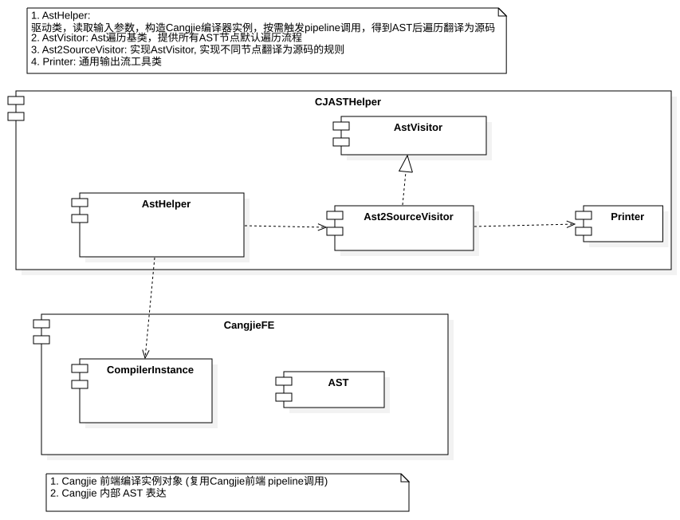
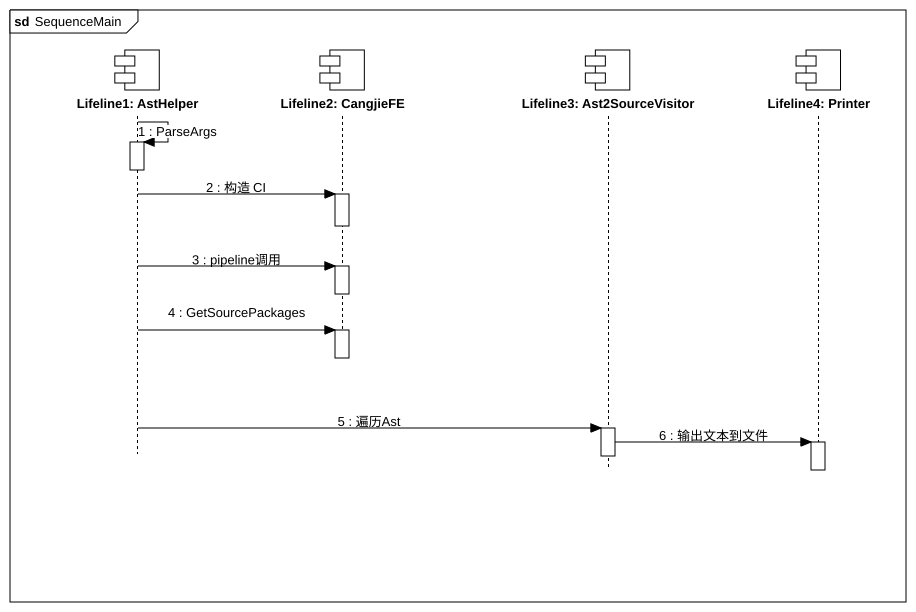

# 架构图

## 组件图



### 模块划分

1. utils 工具模块
    1. 功能： 工具类封装
    2. 依赖： 仅依赖标准库

2. wrapper 封装模块
    1. 功能： 封装外部模块 cangjie-fe （动态库）
        1. 包括 AstNode 等接口封装
    2. 依赖：utils

3. core 核心模块， 依赖 utils， wrapper
    1. 功能： 核心模块，实现 AST 树遍历 和 分析 Pass 的核心接口定义
    2. 模块：
        1. visitor 访问者模块
            1. 功能： 封装 AST 节点访问器
            2. 依赖： utils wrapper
        2. pass 模块 
            1. 功能：提供 Pass 接口定义
            2. 依赖： visitor wrapper utils
    3. 依赖： utils wrapper

4. main 模块
    1. 功能： 提供主入口
    2. 依赖： wrapper，core， utils

### 实现架构图

根据项目当前的模块划分和依赖关系，建议采用动态库方式组织项目，以提高模块化程度和可维护性。

#### 动态库划分建议

按照功能职责将项目划分为以下独立的动态库：

1. **libutils.so** - 工具模块
   - 包含：Logger, ArgHelper, Printer 等工具类
   - 依赖：仅依赖标准库

2. **libcjast_wrapper.so** - Cangjie前端封装模块
   - 包含：WrapperAst, WrapperCangjieFrontend 等封装类
   - 依赖：utils

3. **libcjast_visitor.so** - AST访问者模块
   - 包含：ConstAstVisitor, MutAstVisitor, VisitorBase 等访问者类
   - 依赖：wrapper, utils

4. **libcjast_pass.so** - AST处理Pass模块
   - 包含：DesugarPass, ToSourcePass, Pass 等Pass相关类
   - 依赖：visitor, wrapper, utils

5. **libcjasthelper_core.so** - 核心模块
   - 包含：AstHelper 等核心功能实现
   - 依赖：pass, visitor, wrapper, utils

6. **cjah** - 主程序可执行文件
   - 包含：Main.cpp 主入口点
   - 依赖：core, pass, visitor, wrapper, utils

#### 动态库间依赖关系

```
cjah (可执行文件)
    ↓
libcjast_core.so
    ↓
libcjast_pass.so → libcjast_visitor.so → libcjast_wrapper.so
    ↓                      ↓                    ↓
libutils.so ←────────┴────────────────────┴
```

依赖方向从高层功能指向基础组件，确保依赖关系无环。

#### 项目构建优化建议

1. **构建系统改造**
   - 修改CMakeLists.txt，将STATIC库改为SHARED库
   - 配置动态库间的链接关系
   - 设置正确的RPATH以便运行时查找库文件

2. **接口调整**
   - 确保各模块间的接口清晰且稳定
   - 检查并修复可能的符号可见性问题
   - 更新头文件组织结构

3. **测试验证**
   - 验证所有功能正常运行
   - 测试动态库加载和链接
   - 性能测试确保没有性能下降

#### 优化可行性和步骤分析

##### 可行性分析

1. **技术可行性**：项目当前已采用模块化设计，各模块职责清晰，依赖关系明确，适合重构为动态库。
2. **工具支持**：CMake构建系统支持动态库构建和链接。
3. **兼容性**：通过适当配置，可以保持向后兼容性。
4. **维护性**：动态库结构提高了模块的独立性和可维护性。

##### 优化步骤

1. **第一阶段：构建系统改造**
   - 修改CMakeLists.txt，将`add_library(... STATIC ...)`改为`add_library(... SHARED ...)`
   - 更新`target_link_libraries`指令以正确链接动态库
   - 配置库的安装路径和RPATH设置

2. **第二阶段：接口调整**
   - 确保各模块间的接口清晰且稳定
   - 检查并添加必要的导出宏定义
   - 确保公共接口正确导出，内部实现正确隐藏

3. **第三阶段：测试验证**
   - 运行所有现有测试确保功能完整性
   - 验证动态库的加载和链接正确性
   - 进行性能测试确保没有明显的性能下降

4. **第四阶段：文档更新**
   - 更新构建和部署文档
   - 提供动态库使用说明

#### 拆分优化任务

为了逐步实现动态库重构，可以将工作拆分为以下任务：

##### 任务1：修改src/CMakeLists.txt以支持动态库

- 将`add_library(... STATIC ...)`改为`add_library(... SHARED ...)`
- 更新`target_link_libraries`指令以正确链接动态库
- 配置库的安装路径和RPATH设置

##### 任务2：符号可见性处理

- 检查并添加必要的导出宏定义
- 确保公共接口正确导出，内部实现正确隐藏
- 添加编译器特定的可见性属性

##### 任务3：构建脚本优化

- 更新build.sh以支持动态库构建
- 优化构建输出信息，增加颜色编码等视觉效果
- 添加动态库安装和部署支持

##### 任务4：依赖管理和RPATH配置

- 配置正确的RPATH以便运行时查找依赖库
- 处理第三方库(cangjie-fe)的动态链接
- 确保在不同平台(Linux/macOS)上的兼容性

##### 任务5：测试和验证

- 运行所有现有测试确保功能完整性
- 验证动态库的加载和链接正确性
- 进行性能测试确保没有明显的性能下降

通过以上优化，项目将具有更好的模块化结构，更清晰的依赖关系，以及更灵活的部署选项。这将有助于未来的维护和扩展，同时保持与现有功能的兼容性。


## 重构记录

### AstHelper 中的cangjie前端函数移入 warpper 模块

###

## 交互图


